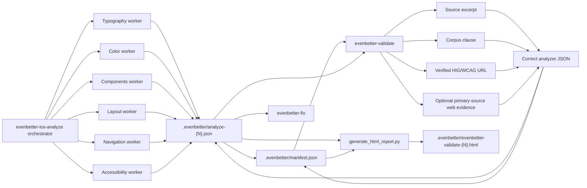

# Architecture

This skill documents the validator part of EvenBetter's compliance-auditing architecture. It combines an analyzer first pass with an evidence-checking correction pass: the analyzer proposes issues and `ai_fix_prompt` values, then the validator corrects the analyzer report so downstream users and fixers see the current issue set.

The analyzer workers make first-pass domain judgments, create `ai_fix_prompt` values, and store each run as a numbered analyzer report indexed by `manifest.json`. The validator does not assume those judgments are correct; it reloads code, reloads the rule clause, verifies or corrects the source URL, optionally uses native web lookup for uncertain cases, corrects severity and guideline references, and rejects unsupported findings through analyzer state.

The resulting HTML report is generated from the corrected analyzer JSON. It focuses on current issues, not on what the validator checked, kept, dropped, or skipped.
