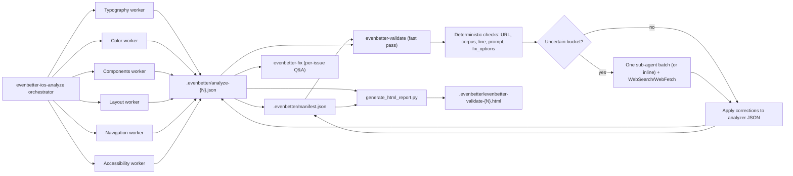

# Architecture

This skill documents the validator part of EvenBetter's compliance-auditing architecture. The analyzer makes first-pass domain judgments and creates `ai_fix_prompt` plus `fix_options` per finding. The validator runs a fast deterministic check pass and only escalates ambiguous findings, then renders the issue-focused HTML report.

The analyzer workers are specialized read-only sub-agents when the host supports Claude Code or Codex subagents. They emit `ai_fix_prompt` plus a 1-4 entry `fix_options` menu per finding so downstream `$evenbetter-fix` can ask the user which alternative to apply.

The validator does not re-run the six-domain analysis. It runs a single deterministic verification pass (URL reachability, corpus clause resolution, source line existence, `ai_fix_prompt` and `fix_options` sanity, severity sanity), buckets findings, and only escalates the `uncertain` bucket — preferably as a single batched sub-agent call, otherwise inline. Web research uses host-native tools only (`WebSearch`/`WebFetch` in Claude Code). The validator orchestrator alone corrects severity, guideline references, and stale `html_report_data`, rejects unsupported findings through analyzer state, updates manifest metadata, and generates HTML.

The resulting HTML report is generated from the corrected analyzer JSON. It surfaces each finding's `fix_options` menu so users see the same remediation alternatives `$evenbetter-fix` will offer.
