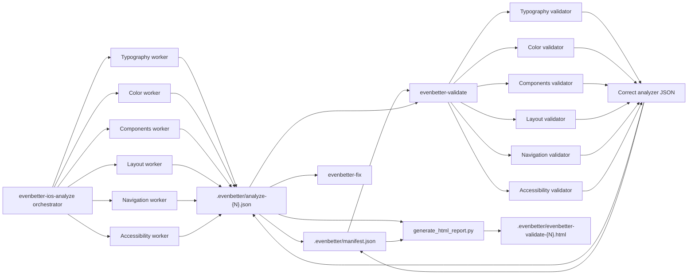

# Architecture

This skill documents the validator part of EvenBetter's compliance-auditing architecture. It combines an analyzer first pass with an evidence-checking correction pass: the analyzer proposes issues and `ai_fix_prompt` values, then the validator corrects the analyzer report so downstream users and fixers see the current issue set.

The analyzer workers are specialized read-only sub-agents when the host supports Claude Code or Codex subagents. They make first-pass domain judgments, create `ai_fix_prompt` values, and return JSON arrays to the analyzer orchestrator, which writes each numbered analyzer report plus the `html_report_data` required by the EvenBetter iOS HIG browser template.

The validator does not assume those judgments are correct. When the host supports sub-agents, it dispatches specialized validator sub-agents by domain or domain-sized batch. Those validators reload code excerpts, rule clauses, verified source URLs, and optional primary-source web evidence, then propose keep/correct/reject actions. The validator orchestrator alone corrects severity, guideline references, and stale `html_report_data`, rejects unsupported findings through analyzer state, updates manifest metadata, and generates HTML.

The resulting HTML report is generated from the corrected analyzer JSON. It focuses on current issues, not on what the validator checked, kept, dropped, or skipped.
