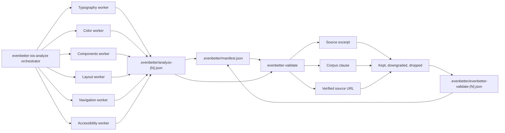

# Architecture

This skill documents the validator part of EvenBetter's compliance-auditing architecture. It combines Anthropic's orchestrator-workers and evaluator-style checking patterns from [Building effective agents](https://www.anthropic.com/engineering/building-effective-agents) into a practical orchestrator-worker-with-validators flow.

The analyzer workers make first-pass domain judgments and store each run as a numbered analyzer report indexed by `manifest.json`. The validator does not assume those judgments are correct; it reloads code, reloads the rule clause, verifies the source URL, and writes a separate numbered validation report with retention statistics for the same run number.

This separation makes the hallucination-control claim citable: the first pass produces candidate violations, while the second pass filters high-severity findings through independently checked evidence.
